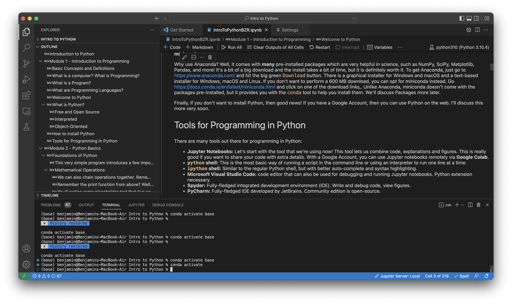
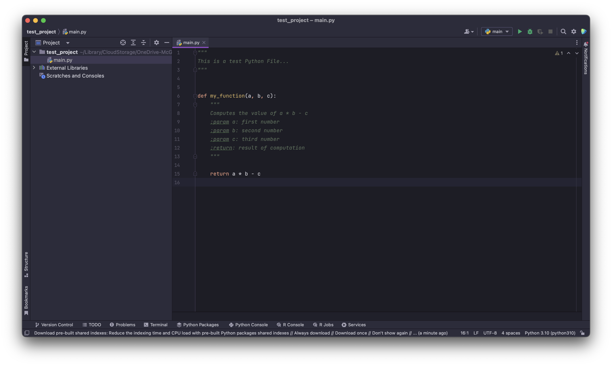
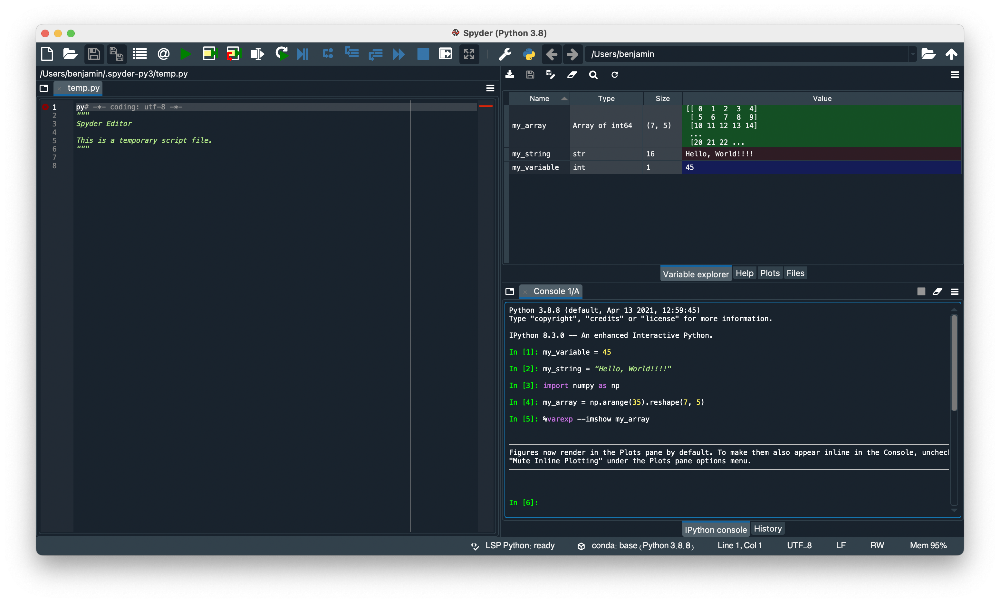

# Welcome & Introduction

Welcome! This document provides a bit of brief extra information about Python. It doesn't have any code, but it covers the basics of what Python is. We won't cover much of this module in the workshop, but the material is included here for reference. Here's the outline for this module:

1.	Welcome to Python
    1.	What is Python?
    2.	Python Installation
    3.	Tools for Using Python

## Welcome to Python

And now, for our major focus: Introducing Python!

### What is Python?
For more on the history, see: https://en.wikipedia.org/wiki/History_of_Python

Python was introduced by Guido Van Rossum in 1991. It has a number of features:
* Free and open source
* Interpreted language
* Object-oriented language

#### Free and Open Source
Being a free and open source language, anyone can download and use Python, but also more! Anyone can distribute Python and even modify Python, or contribute to its development. Python is developed by the **community** that uses it.

#### Interpreted
Python is an *interpreted* language, **not** a *compiled* language. This means that the entire program file is not translated into machine code before it is run. Instead, only parts of the program are translated when they need to be. This means that when you make a change to one part of a program, you don't need to rebuild your entire project. You often just need to restart your interpreter. This also means that you can open Python in your terminal, type in a single line, and it will work!

Recall that programming is like gene expression (following the classical Central Dogma before the messy complexities of reality hit):

* We write code a text that **we** can read, but the computer can't run.
* The computer must convert this into **machine code** that it's hardware can understand, but we can't.

This is like how in a cell, the blueprint for each protein is encoded in DNA, but this DNA must be transcribed and translated to build the protein that performs the function.

#### Object-Oriented
In Python, we use **objects** to represent things. Yeah... I know that doesn't really help. So, objects are a way of representing something, and they group together **data** about that thing (in the form of *attributes*) and **manipulations** that you can do with that thing (in the form of *methods*). Lots of things in Python are represented using these objects from strings of text to lists and you can even make your own (we won't cover that today).

### How to install Python

You've probably done this in the setup for the workshop, but I wanted to go over some of the different ways to install Python.

#### Checking if Python is already installed

If you're on macOS or Linux, lucky you! You might already have Python installed. To see if you do, just open up a terminal window (on macOS, it should be under `Applications > Utilities > Terminal` and on Linux you may be able to just press `Ctrl+Alt+T` to open a terminal window). Once you're there, type `which python`. If you see something that isn't an error message, you already have python. You may also have to try `which python3`. On Windows, if you open `Powershell` and type `python`, then you can also easily find out if you have Python installed. If you don't you'll either get an error message, or the Windows Store will pop up and give you the option to install Python.

#### Installing Python from the Python Website

Now, if you don't have Python installed, you can install it from Python's website at https://www.python.org or get it from the Windows Store or your local software repository on Linux. Installing Python from these sources gives you two main tools:

* `python` - the Python interpreter for running scripts.
* `pip` - the official Python package management tool.

Installing the official distribution gives you the **bare minimum** you need to get up and running in Python.

#### Other Common Distributions

##### Anaconda

While the default installer is good, there is another popular Python distribution: **Anaconda**. 

Why use Anaconda? Well, it comes with **many** pre-installed packages which are very helpful in science, such as NumPy, SciPy, Matplotlib, Pandas, and more! It's a bit of a big download and the install takes a bit of time, but it is definitely worth it. To get Anaconda, just go to https://www.anaconda.com/ and hit the big green `Download` button. There is a graphical installer for Windows and macOS and a text-based installer for Windows, macOS and Linux.

There's another advantage of using Anaconda: it comes with the `conda` tool for installing packages (in addition to `pip`) and managing *environments*. We won't talk about environments today, but the main idea is that you can have multiple different versions of packages, or even different versions of Python, installed on the same computer.

If you install Anaconda, you may never need to install a major package again... but the download is *very, very big* and you may never use some of the packages you install.

##### Miniconda

If you don't want to perform a 600 MB download, you can opt for **miniconda** instead. Miniconda gives you the `conda` tool, but it does **not** install any other packages. Go to https://docs.conda.io/en/latest/miniconda.html and click on one of the download links. 

#### Using Python Online

Finally, if you don't want to install Python, then good news! If you have a Google Account, then you can use Python on the web. I'll discuss this more very soon. There are also other web-based solutions for programming in Python, some of which are described [here](https://www.kdnuggets.com/7-free-online-python-repls).

### Tools for Programming in Python

There are many tools out there for programming in Python:
* **Jupyter Notebooks:** Let's start with the tool that we're using now! This tool lets us combine code, explanations and figures. This is really good if you want to share your code with extra details. With a Google Account, you can use Jupyter notebooks remotely via **Google Colab**.
* **`python` shell:** This is the most basic way of running a script in the command line or using an interpreter to run one line at a time.
* **`ipython` shell:** Similar to the regular Python shell, but with better auto-complete and syntax highlighting.
* **Microsoft Visual Studio Code:** code editor that can also be used for debugging and running Jupyter notebooks. Python extension necessary.
* **Spyder:** Fully-fledged integrated development environment (IDE). Write and debug code, view figures.
* **PyCharm:** Fully-fledged IDE developed by JetBrains. This tool is great for working on larger Python projects. Community edition is open-source.

  
A familiar Jupyter notebook opened in Microsoft Visual Studio Code.

  
Working with a Python file in PyCharm Community Edition.

A sample Spyder window. This may look familiar if you're used to working with MATLAB or RStudio.

## Summary

Here are the main points covered in this brief document:

* **Python** is a programming language that is **open source, interpreted and object-oriented**.
* There are **various ways** to install Python.
* We can use a variety of **tools** to program in Python.

If you want to learn more about Python, there are plenty of resources available online. Welcome to a new language!
