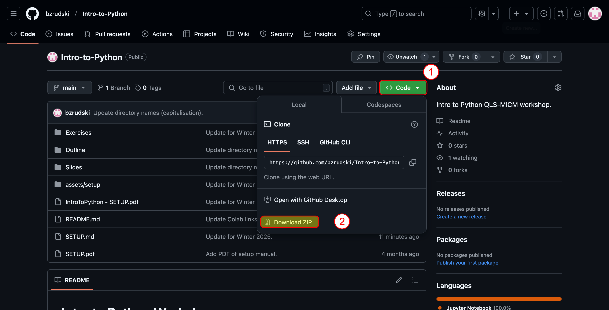
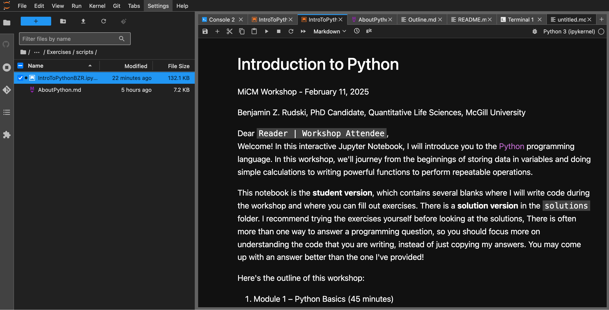

# Introduction to Python - Setup Guide

Benjamin Z. Rudski

Hello workshop attendees! Welcome to the preparation for the **Introduction to Python** workshop run by the *Quantitative Life Sciences - McGill Initiative in Computational Medicine* (QLS-MiCM). In this document, I will help you install the software that you’ll need to get the most out of the workshop. If you’ve already used Jupyter notebooks and you already have a preferred work setup for dealing with these, feel free to stop reading here. If you’ve never used Python before and/or have no idea what a Jupyter notebook is, you’ve come to the right document!

## Workshop Material

All required material for the workshop can be downloaded from the workshop repository, found at https://github.com/bzrudski/micm_intro_to_python_summer_2024. I **strongly encourage** you to download the material **before** the workshop. Go to the workshop repository link and click the green **<> Code** button. Press **Download ZIP** and save the file.



Then, extract the downloaded files. This can usually be done by right clicking and looking for a menu item that says **extract**.

**To make things easier,** make sure to save everything in a folder that is easy to find and is found under your user (home) directory. For example, save it in **Documents** or **Downloads** or **Desktop**.

## Optional Prerequisite for Windows

If you are using Windows, consider installing the [Windows Terminal app](https://apps.microsoft.com/detail/9n0dx20hk701?hl=en-US&gl=US). This app gives you a much better experience working at the command line than the default Command Prompt and Powershell apps.

## Installing Python using Miniconda

To install Python locally, I suggest that you install **[Miniconda](https://docs.anaconda.com/miniconda/)**. Miniconda provides Python, as well as the `conda` tool which is useful for installing packages.

### Quick Installation

The easiest way to install Miniconda is to follow the quick installation instructions at https://docs.anaconda.com/miniconda/#quick-command-line-install.


On your computer, open **Terminal** (macOS and Linux) or **Powershell** (Windows) and follow the instructions for **your operating system** on the web page.


### Alternative Installation

Alternatively, on that same page, you can download an installer for Miniconda. **Make sure to select the correct operating system and architecture.**

Follow the installation instructions **for your platform** on [this page](https://docs.anaconda.com/miniconda/miniconda-install/).

## Installing JupyterLab

Now that you have Miniconda installed, you can set up [**JupyterLab**](https://jupyter.org/) to be able to edit and run Jupyter notebook files.

First, open up **Terminal**. On Windows, you **must** open **Anaconda Prompt** from the Start Menu.

If everything is configured correctly, then you should see `(base)` at the beginning of the line on the screen.


To install JupyterLab, type the following:

```bash
conda install -c conda-forge jupyterlab ipykernel -y
```

This line will use the `conda` package management tool to install JupyterLab and the IPython kernel from the `conda-forge` package channel. Don't worry if this doesn't make sense. It will all be explained in **Intermediate Python** (Part 2). The `-y` option tells `conda` to not prompt us to explicitly approve the installation.

## Opening Jupyter Notebooks in JupyterLab

Now that JupyterLab is installed, we can use it to open our Jupyter notebook. If you don't already have a **Terminal** window open, launch the **Terminal**. On Windows, make sure you open **Anaconda Prompt** from the Start Menu.

If everything is configured properly, you should see `(base)` at the beginning of the line.

Now, type the following to start JupyterLab:

```bash
jupyter lab
```

A web browser (Google Chrome, Microsoft Edge, Firefox) will open up. You may be asked to **Select Kernel**. Choose **Python 3** and click **Select**.


Now, you'll see a blank screen with folders on the left. Use this file browser to locate the workshop materials that you extracted. Find the folder `micm_intro_to_python_fall_2024` and go into the `code` subfolder.


You'll see the Jupyter Notebook file `IntroToPythonBZR.ipynb`. Double-click this file to open in. This file will open, and you'll be able to see all the explanations and the code.



## Running Code in a Jupyter Notebook

Jupyter Notebooks consist of a mix of **text cells** and **code cells**.

To run a code cell, click into it and press the **Play** button (looks like a triangle). Alternatively, on the keyboard, you can press either **`Shift-Enter`** to run the current cell and move to the next one, or **`Ctrl-Enter`** (Windows and Linux) / **`CMD-Enter`** (macOS) to run the current cell without advancing.

## Closing JupyterLab

When you are done using JupyterLab, go to **File > Shut Down** to close JupyterLab. Press the big red **Shutdown** button on the prompt to confirm.


## Concluding Remarks

This is not the only way to install Python and to edit and run Jupyter Notebooks. If you have an existing setup that works for you, feel free to use it. Alternatively, JupyterLab can be used online for free with a Google Account through Google Colab. In fact, I have included the link for opening the workshop material in Google Colab on the workshop's `README` page.

If you have any difficulty setting up Miniconda and JupyterLab, please reach out to me **before the workshop**.